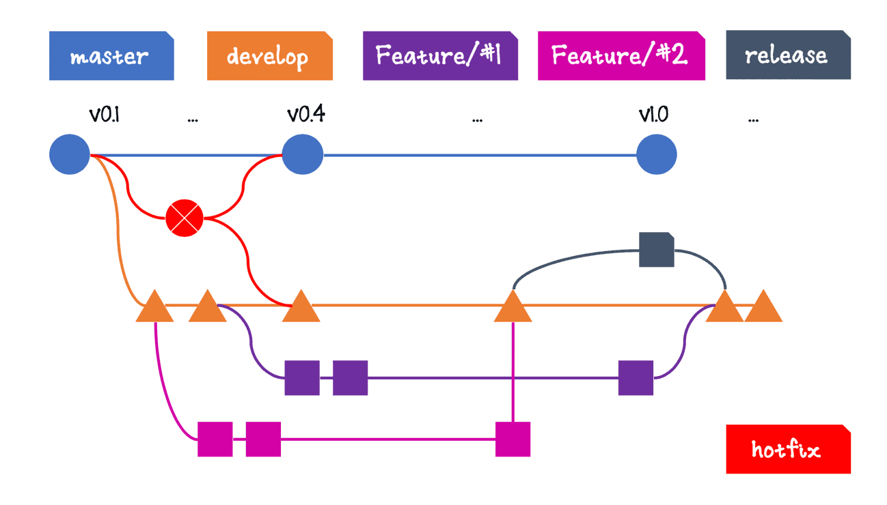

# [UNIROTA](http://escoladeti.unicesumar.edu.br:8082)
## Padrão de commits e branchs 
- Não deverá ser realizado commits na branch master/main
- Toda branch deverá estar relacionda à uma feature do Redmine, com número e uma breve descrição: 
  - Exemplo: *[features/20954-projeto-backend](http://escoladeti.unicesumar.edu.br:8082/issues/20954)*
- Todos os commits deverão estar relacionados à uma task do Redmine
  - Exemplo de commits a serem feitos na branch acima:  *[TASK #20955 CRIAR REPOSITÓRIO E DOCUMENTO DE PULL REQUEST](http://escoladeti.unicesumar.edu.br:8082/issues/20955)*
- Branches de bugfix não devem ser criadas com o nome 'feature'
  - Exemplo: bugfix/00000-autenticacao-quebrada
- Todos Pull Request - com exceção de bugfix - deverá ser feito para a branch de develop

## Critérios de avaliação do Projeto Backend
- Erros de Syntax
- Classes criadas nas camadas corretas. Exemplo: Services na camada de API.
- Code smells (más práticas da linguagem)